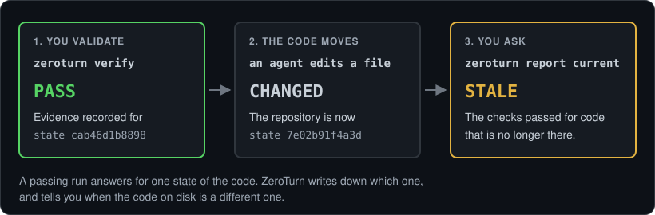

# Validation evidence

A passing run answers a question about one state of the code. `zeroturn verify` writes down which state that was, so a later command can say whether the answer still applies.



```text
$ zeroturn verify
ZEROTURN VERIFY

PASS  vet        0.4s
PASS  test     102.2s

Result: 2 checks passed in 102.5s
Evidence 91ef35e32bc212a8 recorded for repository state cab46d1b8898

$ vim internal/policy/policy.go

$ zeroturn report current
...
Validation  STALE
  Validation is stale because the working tree changed after the last successful run. Run zeroturn verify again for the current code.
  Evidence 91ef35e32bc212a8 recorded 2026-09-16 19:54 for repository state cab46d1b8898
```

## What is compared

The repository state is a digest over:

- the commit
- the content Git holds for everything staged
- the content of every path the working tree disagrees with Git about
- the definition of the validation steps themselves

Editing a step is a change of state like any other, so evidence recorded under different checks does not carry over.

The digest is taken over content, not over the output of `git status`. That output names paths and the category each one is in, and it does not move when you edit a file that was already modified. A digest built from it would report the second version of the code as the state the first version was tested against.

## What it does not prove

It says the checks passed for that code on your machine, at that moment. It is not a claim that the code is correct, that it was reviewed, or that it will pass anywhere else. What the digest does not cover is listed in the [README](../README.md#validation-evidence).

## When it is checked

When you ask: `zeroturn verify`, and `zeroturn report` for the repository you are in. There is no background process and no notification. The status line does not compute it, because the status line repaints constantly and reading the repository there would cost more than the whole repaint budget.

`zeroturn ship` runs the same checks before it commits and does not record evidence for them. Only `zeroturn verify` writes evidence.

## What is stored

Step names, step statuses, exit codes, counts, times, the log file names, and the digests. One record per repository, in ZeroTurn's own state directory and not in your project.

Not stored: step output, because output carries whatever the tool printed. File contents, because the digest stands in for them. The paths of your changed files.

Evidence is not aged out with session records. There is one record per repository and the next run replaces it, because deleting it would report a repository as never validated when it had been. `zeroturn uninstall` removes it with everything else, and so does `zeroturn report purge --all`.

## Recorded without being asked

Evidence written by `verify` is the strongest statement, because `verify` ran every step and watched each one finish.

A step is also recorded when a coding agent runs it, and only then. This is a harness hook: it sees the commands a session makes through its own tools, and a command typed in a terminal never reaches it. A new session is needed after installing it, because settings are read when a session starts. The harness reports each command that succeeded, ZeroTurn compares it with the steps in `.zeroturn.json`, and a match is written down. This exists because the command nobody remembers to run records nothing: in this repository, fifteen changes were merged over five days while the only evidence sat stale, because `verify` wraps commands a developer runs anyway and asks them to run a second one.

Three rules keep such a record honest.

**Only the step, argument for argument.** `go test ./...` is the step. `go test ./internal/policy` is not, and neither is `go test -run TestX ./...`: both did less work than the step describes. They are counted as near misses and recorded nowhere, so that a plan nothing matches can be told from the feature doing nothing.

**A command a shell would read differently is never matched.** `go test ./... && echo done` is not the step, because what ran is not knowable from the string.

**Steps must meet at one state.** A plan reads `passed` only when every step has passed against the same repository state. One step of two is `partial`, and says which are outstanding. A step seen before the code changed is dropped rather than counted towards the state that is here now.

The command is read for that comparison and discarded. What reaches the record is the name of the step it matched.
